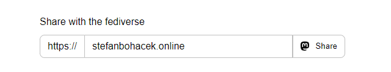

# Fediverse Sharing Button

Let your site's visitors share your work with the fediverse!

You can see a demo at [fediverse-share-button.stefanbohacek.dev](https://fediverse-share-button.stefanbohacek.dev/). For a list of supported platforms, [visit my blog](https://stefanbohacek.com/blog/making-fediverse-apps-for-everyone/#sharing-dialog).

## Features

- minimalist design inspired by Bootstrap
- shows a logo of supported fediverse software
- lets you share selected text
- remembers the last fediverse domain used
- free (as in fediverse) to use!

## How to use

Add the following snippet to where you want your sharing button to show up:

```html
<form class="fsb-prompt">
  <label>Share this page from your fediverse server</label>
  <div class="fsb-input-group mb-3">
    <span class="fsb-input-group-text">https://</span>
    <input required
      type="text"
      name="fediverse-domain"
      placeholder="mastodon.social"
      class="fsb-input fsb-domain"
      aria-label="Server domain">
    <button class="fsb-button"
      type="submit"></span>Share</button>
  </div>
  <p class="fsb-support-note fsb-d-none">This server does not support sharing. Please visit <a
      class="fsb-support-note-link"
      target="_blank"
      href=""></a>.</p>
</form>
<link rel="stylesheet" href="https://fediverse-share-button.stefanbohacek.dev/fediverse-share-button/styles.min.css">
<script src="https://fediverse-share-button.stefanbohacek.dev/fediverse-share-button/script.min.js" defer class="fsb-script"></script>
```

Alternatively, you can download the code from this repo and host all the JS, CSS, and image files yourself.

For alternative uses of this project, see the [Tutorials](#tutorials) section.

## FAQ

### Q: How does this work?

Some fediverse platforms let you [open a sharing prompt via a URL](https://stefanbohacek.com/blog/making-fediverse-apps-for-everyone/#sharing-dialog), much like many [corporate social media sites](https://stefanbohacek.com/blog/simple-sharing-buttons/#facebook).

My sharing button [detects the software](https://github.com/stefanbohacek/fediverse-info) running on the platform based on the provided URL, and shows a matching fediverse logo (courtesy of [Liaizon Wakest](https://fediverse.wake.st/)).

### Q: Does this button or the fediverse-info server collect any information?

None at all. The [fediverse-info](https://github.com/stefanbohacek/fediverse-info) server is only needed to cache the software information for each domain as not to overwhelm the original server with too many requests.

The last domain used in the domain input field and the fediverse software it's running are both stored in the [site visitor's browser](https://en.wikipedia.org/wiki/Web_storage) so that when they view another page, or visit the site again later, this information can be reused.

### Q: Are there any similar projects?

Yes, see a list here: https://github.com/Uden-AI/fediverse-share#similar-projects-to-compare-to, including the [fediverse-share](https://github.com/Uden-AI/fediverse-share) project itself.

Additional projects include:

- [ShareOpenly](https://shareopenly.org/) by [Ben Werdmuller](https://about.werd.io/)
- [Mastodon Share](https://mastodonshare.com/) by [Alex Barredo](https://mastodon.social/@barredo)

### Q: Is this really free to use?

Yep. Attribution and/or link back to the project would be nice, but are not required. And if you have any extra cash, see [stefanbohacek.com/support-my-work](https://stefanbohacek.com/support-my-work/).

### Q: Any way I can share feedback and suggestions?

Yes, feel free to [open an issue](https://github.com/stefanbohacek/fediverse-share-button/issues?q=is%3Aissue+is%3Aopen+sort%3Aupdated-desc) on this repo, or find my contact information [on my website](https://stefanbohacek.com/contact/).

See also the [#enhancement](https://github.com/stefanbohacek/fediverse-share-button/issues?q=is%3Aopen+label%3Aenhancement+sort%3Aupdated-desc) tickets for planned features and changes.

## Tutorials

- [Adding a Fediverse Share Button to my Emacs Nikola Blog](https://blog.notroot.online/posts/adding-a-fediverse-share-button-to-my-emacs-nikola-blog/) by [Notroot](https://notroot.online/@notroot)

## Development

After making changes to the JS and CSS files, make sure to minify them.

```sh
npm install terser -g
npm install minify -g
terser fediverse-share-button/script.js > fediverse-share-button/script.min.js
minify fediverse-share-button/styles.css > fediverse-share-button/styles.min.css
```

## Attributions

### Icons

- [fediverse.wake.st](https://fediverse.wake.st)
- [flowbite.com/icons](https://flowbite.com/icons)

### JS and CSS code

- https://getbootstrap.com
